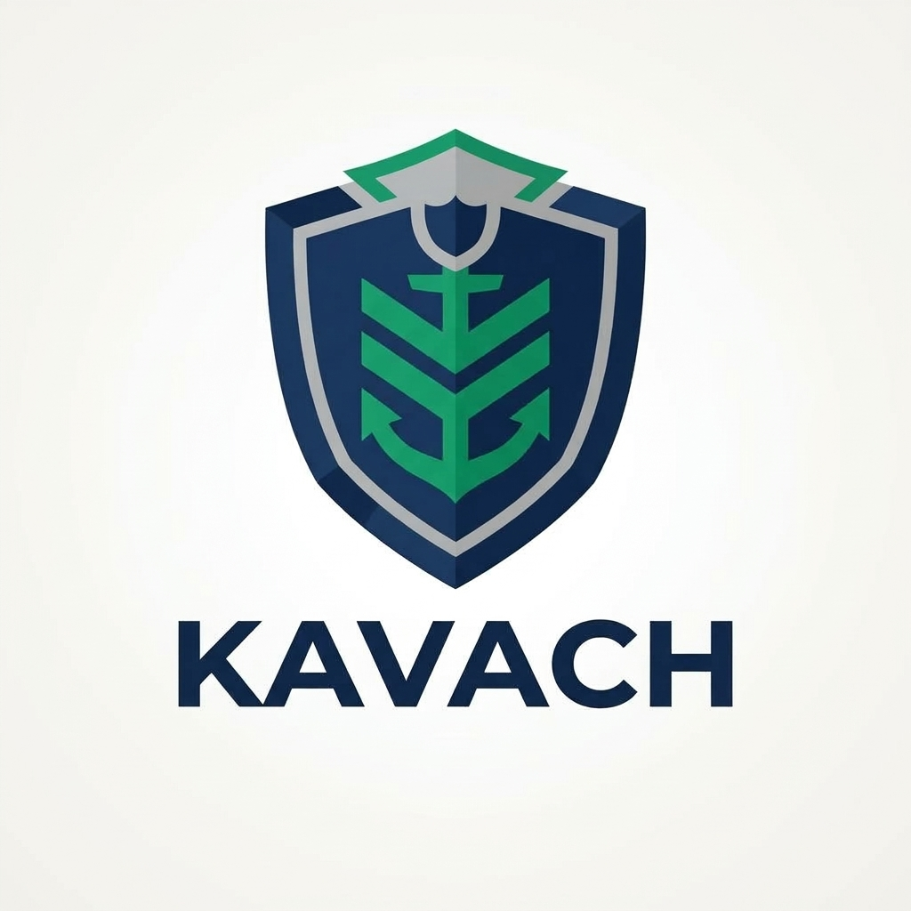

# Kavach (SIH-PS26125)

<p align="center">
  
</p>

A next-generation, blockchain-based secure platform for Identity, Access Control, and Digital Asset Management. Developed for Bharat Electronics Limited (BEL) under the Smart India Hackathon (SIH) 2026.

## Table of Contents
- [Overview](#overview)
- [Key Features](#key-features)
- [Tech Stack](#tech-stack)
- [Prerequisites](#prerequisites)
- [Getting Started](#getting-started)
- [Architecture](#architecture)
- [Smart Contracts](#smart-contracts)
- [Testing](#testing)
- [Deployment](#deployment)
- [Troubleshooting](#troubleshooting)

---

## Overview

The contemporary enterprise ecosystem is overwhelmingly reliant on centralized Identity and Access Management (IAM) systems. Centralized databases act as single points of failure, vulnerable to cyberattacks and insider threats. **Kavach** solves this by leveraging distributed ledger technology to integrate self-sovereign identity, Soulbound Tokens (SBTs), and smart contract-driven access control into a unified, mathematically verifiable framework.

### Key Features
- **Decentralized Identity via Soulbound Tokens**: Implements the ERC-5192 standard to issue non-transferable NFTs representing a user's organizational identity and clearance levels.
- **Adaptive Attribute-Based Access Control (ABAC)**: Replaces legacy Role-Based Access Control (RBAC) with dynamic smart contracts that evaluate clearance, department, and contextual attributes before granting access.
- **Account Abstraction (ERC-4337)**: (Simulated in MVP) Eliminates seed-phrase vulnerabilities by utilizing programmable smart contract wallets and Paymasters for enterprise-sponsored gas fees.
- **Immutable Audit Trail**: Every access request (granted or denied) is permanently recorded on-chain, ensuring total transparency and compliance with data protection laws (e.g., DPDP Act 2023).

---

## Tech Stack

- **Smart Contracts**: Solidity ^0.8.24
- **Blockchain Framework**: Hardhat (EVM target: Cancun)
- **Frontend**: Next.js 14 (React 18)
- **Styling**: Tailwind CSS
- **Web3 Integration**: Ethers.js
- **Contract Standards**: OpenZeppelin Contracts v5.0.0

---

## Prerequisites

Before setting up the project locally, ensure you have the following installed on your machine:
- **Node.js**: v18.0.0 or higher (required for Next.js 14 and Hardhat)
- **npm**: v9.0.0 or higher
- **Git**: For version control
- A Web3 Wallet (like MetaMask) installed in your browser (optional for this mocked MVP phase)

---

## Getting Started

Follow these instructions to get the Kavach prototype running on your local machine.

### 1. Clone the Repository

```bash
git clone https://github.com/yourusername/SIH26125-HouseStark-KAVACH.git
cd SIH26125-HouseStark-KAVACH
```

### 2. Setup the Smart Contracts

Navigate into the `contracts` directory, install dependencies, and compile the Solidity code:

```bash
cd contracts
npm install

# Compile the smart contracts (Generates artifacts and typechain files)
npx hardhat compile
```

### 3. Setup the Frontend Dashboard

Open a **second terminal window**, navigate to the `web` directory, and install the Next.js dependencies:

```bash
cd web
npm install
```

### 4. Start the Application

In your first terminal (inside `contracts/`), you can spin up a local Hardhat blockchain and deploy the contract if you wish to interact manually:
```bash
npx hardhat node
```
*(In a third terminal)*:
```bash
cd contracts
npx hardhat run scripts/deploy.js --network localhost
```

In your second terminal (inside `web/`), start the Next.js development server:
```bash
npm run dev
```

Open your browser and navigate to [http://localhost:3000](http://localhost:3000) to view the Kavach Dashboard.

---

## Architecture

### Directory Structure

```text
SIH26125-HouseStark-KAVACH/
├── contracts/                        # Hardhat Project
│   ├── contracts/
│   │   └── KavachIdentity.sol        # Core Identity and ABAC Smart Contract
│   ├── scripts/
│   │   └── deploy.js                 # Deployment script
│   ├── test/
│   │   └── KavachIdentity.js         # Chai/Mocha test suite
│   ├── hardhat.config.js             # Hardhat configuration (Solidity 0.8.24, Cancun)
│   └── package.json                  # Contract dependencies
│
├── web/                              # Next.js Frontend
│   ├── src/
│   │   ├── app/
│   │   │   ├── globals.css           # Global Tailwind styles
│   │   │   ├── layout.tsx            # Next.js Root Layout
│   │   │   └── page.tsx              # Main Dashboard Page
│   │   └── components/
│   │       └── Dashboard.tsx         # Interactive React UI for the prototype
│   ├── public/
│   │   └── kavach_gov_logo.jpg       # Project Branding
│   ├── tailwind.config.ts            # Tailwind configuration
│   └── package.json                  # Web dependencies
│
├── logo.jpg                          # Root level branding
└── README.md                         # This file
```

### Data Flow (Prototype)

1. **User visits Dashboard**: The Next.js app serves the static UI.
2. **Wallet Connection**: User simulates connecting an ERC-4337 Smart Contract Wallet.
3. **Identity Minting (SBT)**: The `MANAGER_ROLE` (admin) calls `issueIdentity()` on `KavachIdentity.sol`, minting an ERC-5192 Soulbound Token to the user's address. The token locks permanently.
4. **Access Request**: The user attempts to access a restricted resource. The frontend calls `requestAccess()`.
5. **ABAC Evaluation**: `KavachIdentity.sol` evaluates the user's on-chain attributes (Security Clearance, Department, Active Status) against the resource's requirements.
6. **Audit Trail**: The smart contract emits either an `AccessGranted` or `AccessDenied` event, which the frontend listens to and renders in the Immutable Audit Trail log.

---

## Smart Contracts

The heart of Kavach is `KavachIdentity.sol`. 

### Key Functions
- `issueIdentity(address to, uint8 clearance, string department)`: Mints an ERC-721 token, maps ABAC attributes to it, and locks it via ERC-5192 (`_lockedTokens[tokenId] = true`).
- `requestAccess(uint256 tokenId, string resourceId, uint8 requiredClearance, string requiredDepartment)`: The Policy Decision Point (PDP). Evaluates incoming requests based on boolean logic against the user's mapped attributes.
- `locked(uint256 tokenId)`: Returns `true` ensuring the token is Soulbound. Transfer functions (`transferFrom`, `safeTransferFrom`) are overridden to revert if `locked == true`.

---

## Testing

The smart contracts are thoroughly tested using Hardhat, Mocha, and Chai.

### Running Tests

Navigate to the `contracts` directory and execute:

```bash
npx hardhat test
```

### Test Coverage
- Ensures identity tokens are successfully minted.
- Verifies ERC-5192 compliance (tokens cannot be transferred).
- Validates the ABAC logic (Access is granted when clearance matches, and denied when clearance is insufficient).

---

## Deployment

While this repository is configured for local testing (Hardhat Node), deploying to an enterprise permissioned network (like Hyperledger Besu) or a public testnet (like Sepolia) requires minimal configuration changes.

### Deploying to a Testnet

1. Create a `.env` file in the `contracts/` directory:
   ```env
   PRIVATE_KEY="your-wallet-private-key"
   RPC_URL="https://eth-sepolia.g.alchemy.com/v2/YOUR_API_KEY"
   ```
2. Update `hardhat.config.js` to include the network:
   ```javascript
   require('dotenv').config();
   module.exports = {
     solidity: { version: "0.8.24", settings: { evmVersion: "cancun" } },
     networks: {
       sepolia: {
         url: process.env.RPC_URL,
         accounts: [process.env.PRIVATE_KEY]
       }
     }
   };
   ```
3. Run the deployment script:
   ```bash
   npx hardhat run scripts/deploy.js --network sepolia
   ```

---

## Troubleshooting

### Hardhat: `Function "mcopy" not found`
**Error**: Compilation fails due to `mcopy` missing in `@openzeppelin/contracts`.
**Solution**: OpenZeppelin v5 utilizes Cancun hardfork instructions. Ensure your `hardhat.config.js` targets the `cancun` EVM version:
```javascript
solidity: {
  version: "0.8.24",
  settings: { evmVersion: "cancun" }
}
```

### Next.js: `Module not found: Can't resolve 'lucide-react'`
**Error**: Missing icons library in the frontend.
**Solution**: Run `npm install lucide-react` inside the `web/` directory.

### NPM Permissions on Windows
**Error**: `Unable to read current working directory: Permission denied`
**Solution**: Ensure you are running PowerShell or Command Prompt as an Administrator, or verify that your antivirus is not locking the `node_modules` folder during installation.
